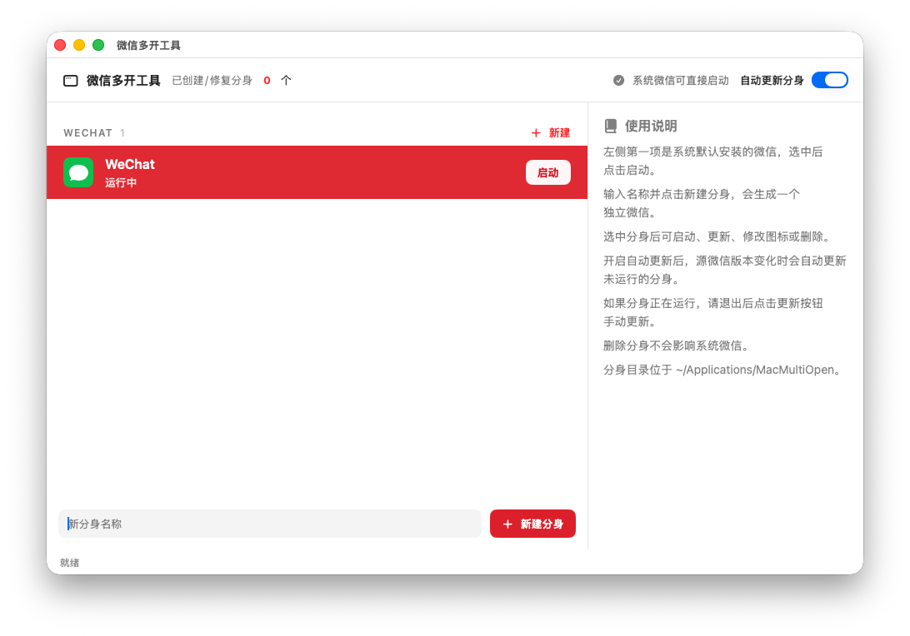

# 微信多开工具

一个本地 macOS 多开工具，用来创建微信、企业微信的独立分身 App。



## 功能

- 自动发现 `/Applications` 和 `~/Applications` 中的微信、企业微信。
- 创建完整 `.app` 分身副本，每个分身使用独立 `CFBundleIdentifier` 和独立 macOS 容器。
- 只重新签名外层 App，保留内部框架的原始签名，避免 `--deep` 重签导致微信 4.x 崩溃。
- 支持启动、更新、删除、Finder 显示。
- 支持为已创建分身设置自定义图标。
- 记录源微信版本；源微信升级后可自动或手动更新分身。
- 提供 SwiftUI 图形界面和 `multiopen` 命令行。

## 构建

```sh
swift run MultiOpenTests
swift build --product multiopen
swift build --product MacMultiOpenApp
sh scripts/build_app.sh
sh scripts/package_installer.sh
```

指定版本打包：

```sh
VERSION=0.1.1 sh scripts/package_installer.sh
```

应用图标使用固定资源 `Resources/AppIcon.icns`，打包时直接复制到 `.app`。

打包后的应用位于：

```text
dist/微信多开工具.app
```

安装包位于：

```text
dist/微信多开工具-0.1.0-universal.pkg
```

安装包会把应用安装到：

```text
/Applications/微信多开工具.app
```

## CLI

```sh
.build/debug/multiopen scan
.build/debug/multiopen create --source /Applications/WeChat.app --name 工作微信
.build/debug/multiopen list
.build/debug/multiopen launch 工作微信
.build/debug/multiopen update 工作微信
.build/debug/multiopen update-all
.build/debug/multiopen set-icon 工作微信 --icon ~/Desktop/icon.png
.build/debug/multiopen repair 工作微信
.build/debug/multiopen delete 工作微信
```

## 说明

这个项目不破解、不修改微信原始安装包；它会复制源 App，改写副本的 `CFBundleIdentifier`、显示名和 URL schemes，然后只对外层 App 做本地签名。微信升级后可以对已有分身执行“更新”来重新复制当前版本，并保留分身名称和自定义图标。

## License

Apache License 2.0. See [LICENSE](LICENSE).
